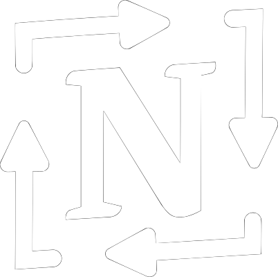

# Notion Recurring Tasks

Using the Notion API to achieve recurring tasks in Notion.

*[Read the full documentation on ReadTheDocs](https://notion-recurring-tasks.readthedocs.io/)*

## General Information

Notion is a great productivity tool for tracking goals, projects and tasks. However, achieving recurring tasks (tasks whos due date repeats at a set interval) is a hassle and requires manual intervention without external tools. Thanks to the Notion API we can access our task data programatically and make specific tasks recur automatically. This software can be connected to a tasks database in Notion and update the Status and Due Date of these tasks accordingly.

### Technologies

- Python =3.12
- Requests >= 2.31
- Dateutil >= 2.8
- Dotenv >= 1.0

### Features

- Connect to a Notion database through a Notion Integration
- Detect recurring tasks in a connected Notion database
- Set new Status and Due Date accoring to task properties
- More features coming! See [Roadmap](#roadmap)..

### Project Layout

    .github/                        # Github Workflows
    
    docs/                           # Documentation Source

    scripts/                        # Helper Scripts

    src/                            # Package Source Code

        notion_recurring_tasks/     # Main Package
        README.md                   # Code Reference README

    tests/                          # Pytest Tests

        functional/                 # Testing if the code does the right things
        unit/                       # Testing if the code does things right
        conftest.py                 # Pytest Configuration

    .gitignore                      # Ignoring unnecessary files
    .readthedocs.yml                # ReadTheDocs Configuration
    LICENCE.md                      # MIT Licence
    mkdocs.yml                      # Documentation Configuration
    pyproject.toml                  # Project Meta Information
    README.md                       # Project README

## Setup

### Usage

To get started with this package it is recommended to follow the [Getting Started tutorial](https://notion-recurring-tasks.readthedocs.io/tutorial/getting-started) in the full documentation.

But if you are feeling dangerous, here is the quick rundown:

1. Download a [release of the program](https://github.com/Theeoi/notion-recurring-tasks/releases)
2. Set up a [Notion Integration](https://www.notion.so/my-integrations) and get a Notion API key
3. Set up your Notion database with the required properties and integration
4. Install and run the software
    - The software will prompt you for the key from step 2
5. [Optional] Automate the execution of the software

### Contributing

To contribute or modify this code you should do the following:

1. Fork this repository
2. Clone your forked repo and `cd` into it
3. Create a Python virtual environment and activate it
4. Run `python -m pip install .[dev]` to install the development dependencies
5. Make your changes as appropriate
6. Test your code using `pytest`
7. [Optional] Make a pull request to this repository

## Project Status

The first release is published and the documentation is being caught up to cover all aspects of the software. Documentation is done to the degree that *anyone* can get started with the software, but not to the degree where *anyone* could modify the software to fit their needs.
There are currently no new features planned.

### Roadmap

TODO:

- [x] Implement testing suite
- [x] Refactor script
- [x] Add way to programatically add your own NOTION_KEY
- [ ] Add complete documentation

Room for Improvement:

- Expand testing

## Contact

This code is written and maintained by [Theodor Blom](mailto:me@theodorblom.com).
