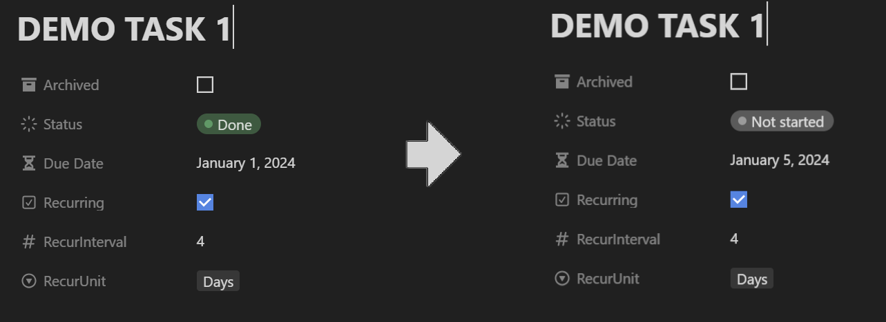
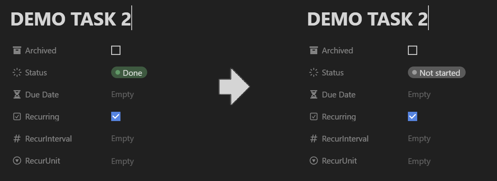
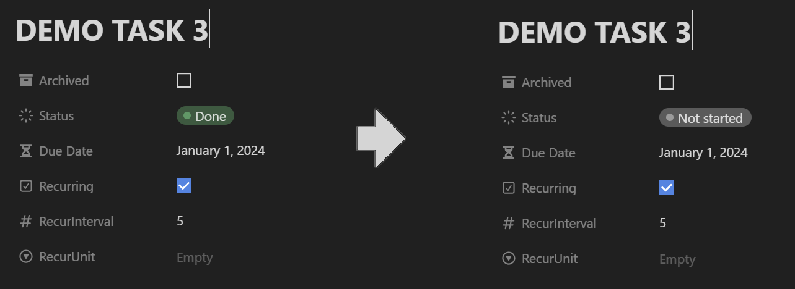
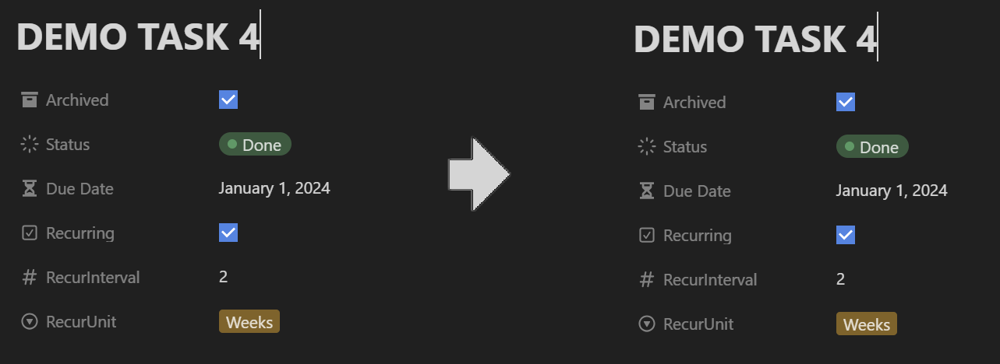

# Demonstration

The purpose of the Notion Recurring Tasks software is to detect tasks in your Notion which are marked for recurrance and update them according to the task properties. In the below demonstration you will see a set of images showing how these tasks are updated when running the software.

The above task is done and marked to recur with all properties set. The Status is reset to 'Not started' and the Due Date is set to the new date accoring to the recur properties. The available units are: Days, Weeks, Months and Years.

Tasks do not *need* a Due Date to recur. Here the Status is simply reset to 'Not started'. This is useful if you have tasks that are dependant on something else than a Due Date.

If a recurring task is missing one of the recur properties, it resets the Status but keeps the old Due Date.

If a task is marked as Archived it is ignored and does not recur.

## Why is this Preferrable to Other Options?

There are other solutions to achieving recurring tasks in Notion. Below are some examples comparing them to this software.

### Notion built in Recurring Templates

My personal preference is always to try and stick to native solutions. The [Notion Recurring Templates](https://www.notion.so/help/guides/automate-work-repeating-database-templates) are a good addition to Notion but they are lacking in the recurring tasks front. You are able to configure a recurring template to have a due date on the date they recur. Meaning that immediately when the task is created it is also due. To me this does not cut it since for some tasks I want to have them on my mind before they are due. This software creates the new task when the old one is done allowing you to see the upcoming due date with a database view.

Additionally, I believe that recurring tasks should be as similar to regular tasks as possible. Having the recurring tasks as unique templates on the database leads to clutter on the template dropdown. The recurring tasks should be a set-and-forget kind of thing and not something you have to scroll through when looking for that task template you are after.

One downside to using this software compared to recurring templates is that the recurring tasks are *updated* and not *copied*. This means that if you rely on being able to track the amount of tasks you have done over a longer period of time these recurring tasks will not be able to be tracked. Unless you are using some Notion magic I am unaware of.. That tasks are updated rather than copied could be implemented as an optional feature in the future though.

### Thomas Franks Implementation

[Thomas Franks implementation](https://thomasjfrank.com/notion-automated-recurring-tasks/) is very similar to this software. However, it requires some additional properties on the database that I don't feel are necessary. Specifically the requirement to set up a 'Next Due' formula property and the quite wonky implementation of the 'Days' property.

This software focuses on adding as little overhead as possible to your databases while still getting the functionality in place. The days functionality (being able to specify which days of the week a task should recur) could be useful in some circumstances and might be implemented as an optional property to this software in the future.
