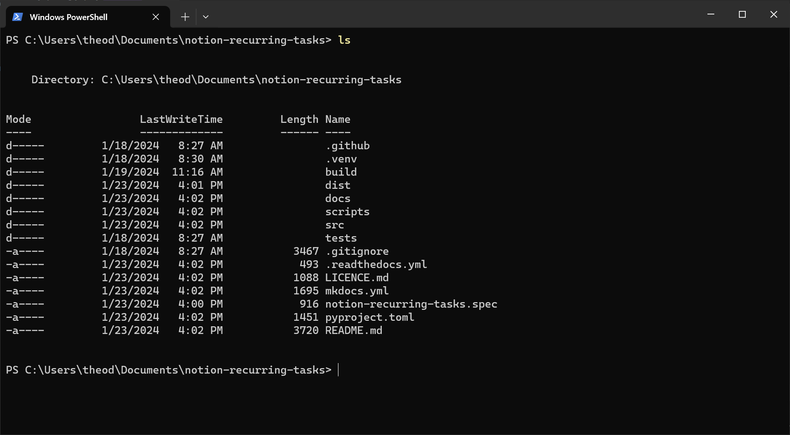
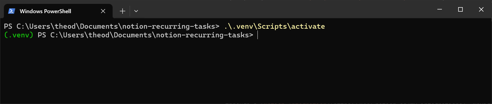
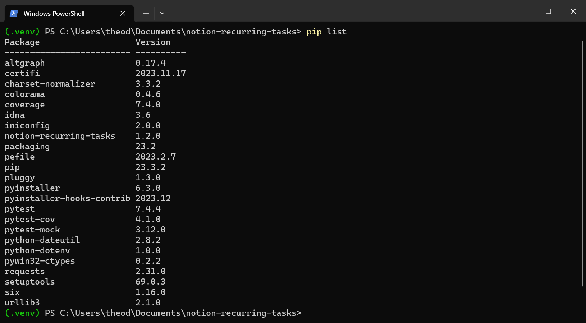
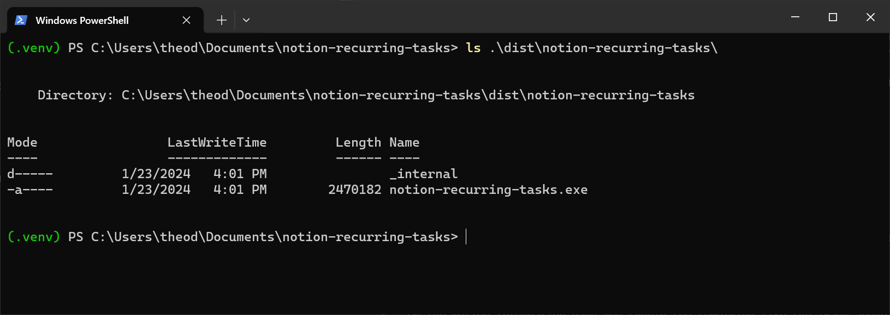

# Building an Executable from Source

Building an executable from the source code requires some computer prowess. It requires navigating a terminal and running a few commands to install the software and create the executable. This guide will break down the process in easy-to-follow steps to the level that anyone should be able to follow along. After this you should continue the [Getting Started tutorial](getting-started.md#setting-up-your-notion-integration) to set up your Notion database and integration.

## Getting the Source Code

The first step is to get the source code and be able to explore it through a terminal window.

The source code is available with every release on the [release page on Github](https://github.com/Theeoi/notion-recurring-tasks/releases). Download the Source code and extract it to an appropriate location.

Open a terminal and navigate to the source code. There are multiple ways of doing this but an easy option is to navigate to the extracted folder in a file explorer, right click in the folder and select 'Open in terminal'. If successful you should be able to to type `ls` and see the contents of the directory.

## Installing the Software and Development Dependencies

To build the executable we must install everything required to do so. When installing Python packages it is customary to create what is known as a virtual environment and install the package there. This is done as to seperate this install from interfering with other installed Python packages on your system.

Run the following terminal command in the source code directory `python3.12 -m venv .venv`. If you receive an error it could mean that you do not have the correct version of Python installed. [Install Python 3.12](https://www.python.org/downloads/) and retry the above command.

Having created a the virtual environment we can now activate it using the following commands:

- Windows: `.\.venv\Scripts\activate`
- Linux/macOS: `source .venv/bin/activate`

If successful you should see the name of the virtual environment by the commandline.

We can now move on to install the Notion Recurring Tasks package itself along with the dependences required to build the executable. Run the following command `python -m pip install .[dev]` with the virtual environment activated.

If the install was successful you should be able to run the command `pip list` and see all packages installed in the virtual environment.

## Building the Executable

Now we are ready to build our executable. The source code includes a helper script to do the heavy lifting for us. Run the script using:

- Windows: `python .\scripts\build_executable.py`
- Linux/macOS: `python scripts/build_executable.py`

The built executable is created in the `dist` directory. Navigate to it either through the terminal or a file explorer.

Now that you have created your own executable you should continue the [Getting Started tutorial](getting-started.md#setting-up-your-notion-integration) to set up your Notion database and integration.
