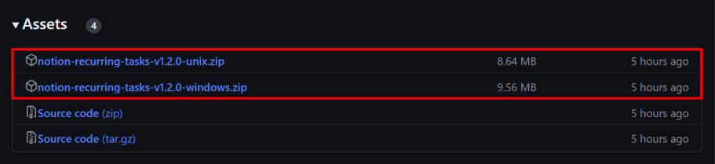
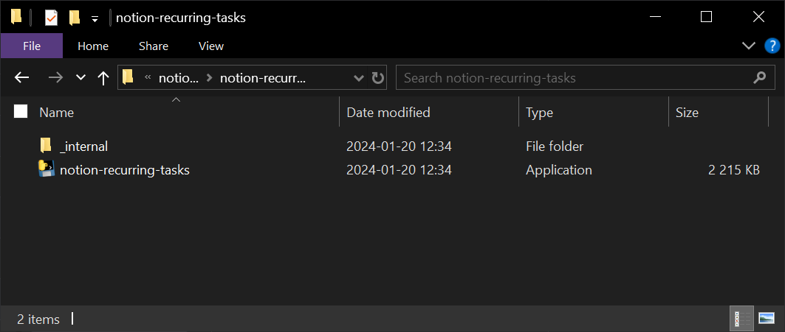
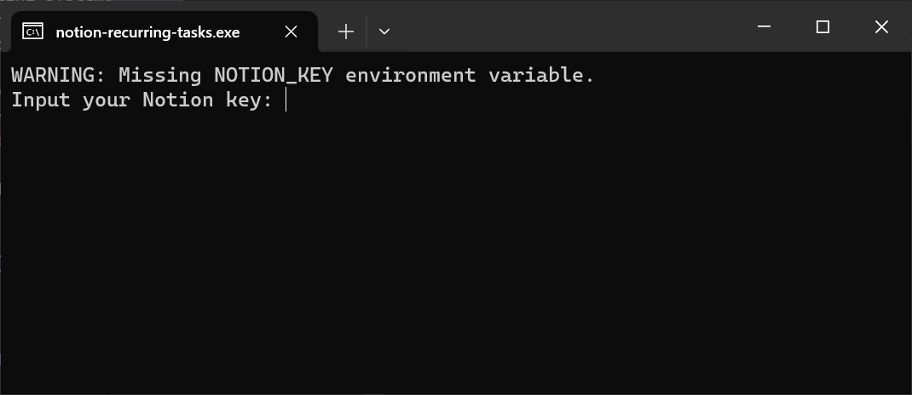
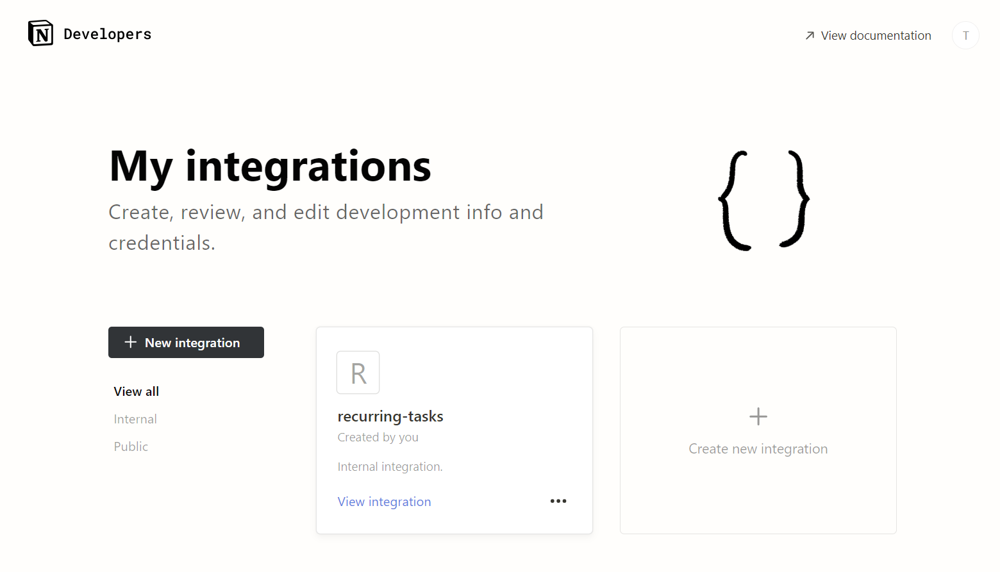
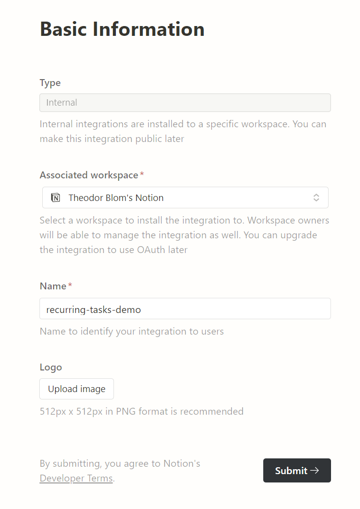
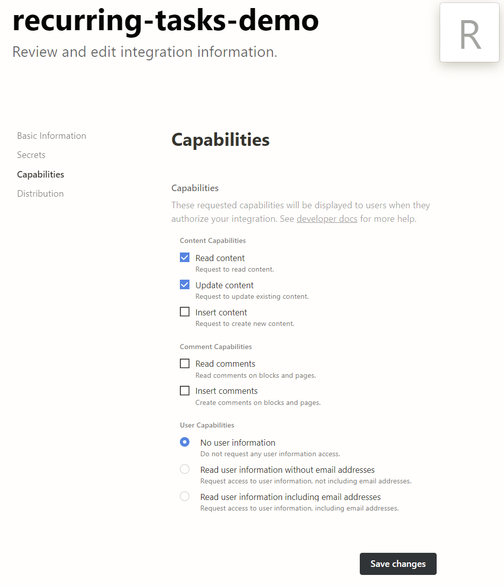
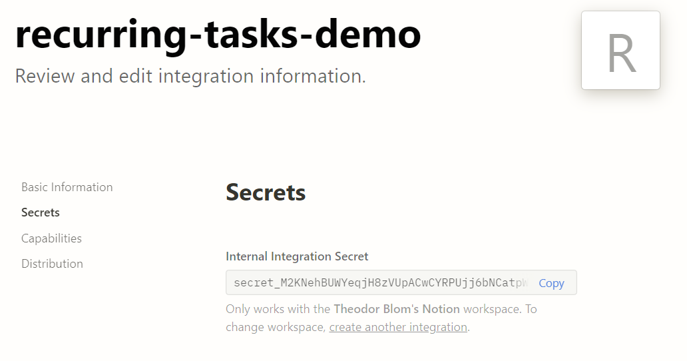
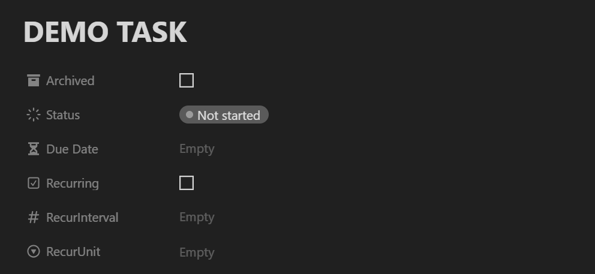
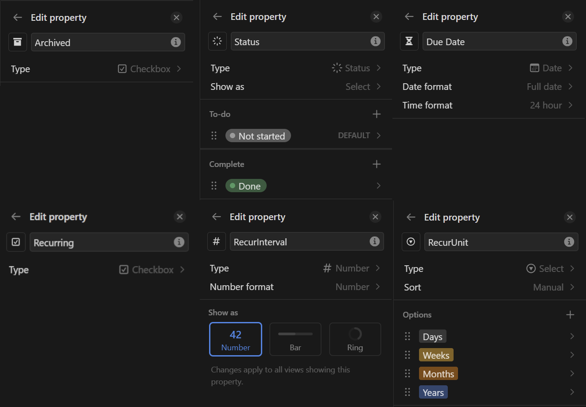
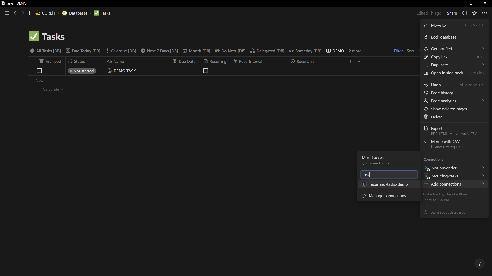

# Getting Started

Congratulations on deciding to get started using the Notion Recurring Tasks software!

The road ahead can be a little complex if you are not used to working with APIs and Notion databases. But this tutorial will break down the process in four easy-to-follow steps. Once you have completed this tutorial the software and your Notion will be set up for continous use without complications.

And remember, if you have trouble following this tutorial or have any other questions please do not hessitate to reach out through the [support page](../index.md#support).

## Getting the Software

The first step is to get the software onto your computer. There are 3 ways of doing this where the first two revolve around downloading (or cloning) the source code. From there you can either [install the software](install-from-source.md) or [build an executable](build-from-source.md). The third option is to download an already built executable.

For the purposes of this tutorial we will be downloading an already built executable of the software. You should *always* be cautious of downloading an executable from the internet! So if you do not trust the files you are about to download then it is recommended to instead choose one of the above two options.

You can find the software on the [release page on Github](https://github.com/Theeoi/notion-recurring-tasks/releases). On the various releases there are assets as shown in the image above.

The source code assets contain a copy of the source code at the time of the release. The other assets are compressed executables of the software (marked in red) built for specific operating systems (windows for Windows and unix for Linux/MacOS). Download the one appropriate for you. After downloading, extract the `.zip` to an appropriate location.

> :grey_exclamation: **NOTE**: For Windows users, NordVPNs file protection service (and possibly other similar services) will immediately delete `notion-recurring-tasks.exe`. Please disable such services before extracting.

If done successfully, you should now have the `notion-recurring-tasks` directory with the content shown below and be able to run it.

## Setting up your Notion Integration

Before moving onward with the software, it is required to allow the software to interact with your Notion. This is done through a [Notion Integration](https://www.notion.so/my-integrations). Navigate to that page and login using your Notion account.

On the Notion Integration page you should see something like the image above. Create your integration by pressing '+ Create new integration' and fill in some basic information like below. It is important to select the Notion Workspace in which your recurring tasks database will be. Choose a name that is descriptive of what the integration does and is easily identifiable. This will help you later.

After your integration is created you can change its capabilities on the 'Capabilities' page. The Notion Recurring Tasks software only needs access to read and update tasks in your task database, and therefore it is recommended to limit it accordingly.

The 'Secret' page contains the Notion key that is required to connect the software to your integration. We will use this key in a future step.

> :warning: **WARNING**: DO NOT SHARE THIS NOTION KEY WITH ANYONE!

## Preparing your Task Database within Notion

The next step is to create the necessary properties in your task database within Notion and add your newly created integration to it.

In your task database, every task must have the following properties set up like below: *Archived, Status, Due Date, Recurring, RecurInterval and RecurUnit*. The two images show a demo task with the properties added as well as an overview of each property and how they are set up in the database. If you are unfamiliar with how to set up properties in a database, it is recommended to read [Thomas Franks guide](https://thomasjfrank.com/notion-databases-the-ultimate-beginners-guide/#database-properties) on the topic.

> :grey_exclamation: **NOTE**: You can have more task properties than the minimum required. Add these to a new database or integrate the properties with your already existing tasks database.

The final step is to add your previously created Notion integration to this database. *On the page of the database*, press the three dots in the far upper right corner. Go to 'Add connections' and search for the name of your integration. Once added it should show up in the list of connections.

> :grey_exclamation: **NOTE**: Since the connection is added to the database itself and not the workspace, the connection will not be visible on the connections list elsewhere.

## Running the Software

Congratulations! With your Notion database set up you are ready to run the software and try it out.

As we saw earlier, the software prompts you for your Notion key upon starting up. Copy the secret key from your integration you created earlier and input it to the software. If everything is set up properly the software should print how many tasks it managed to update with a new Due Date according to the set properties. If not (or you are getting an error), please dubble check that everything is set up as instructed above.

If you are still experiencing issues, please get in touch through the [support page](../index.md#support).
